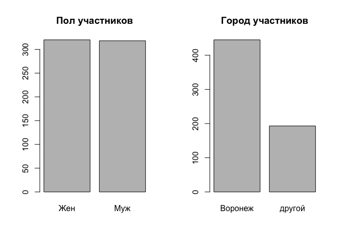
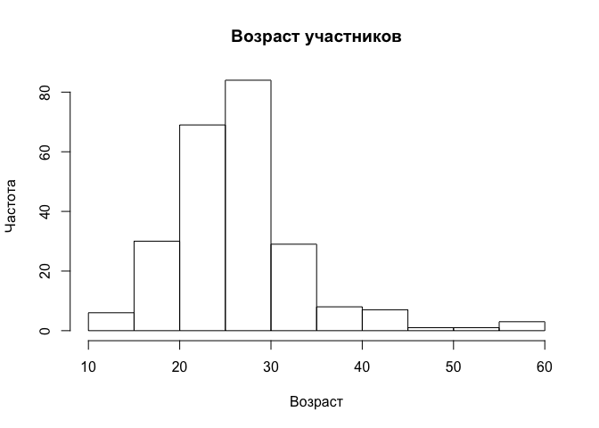
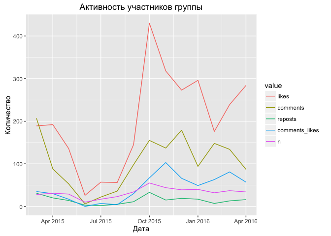
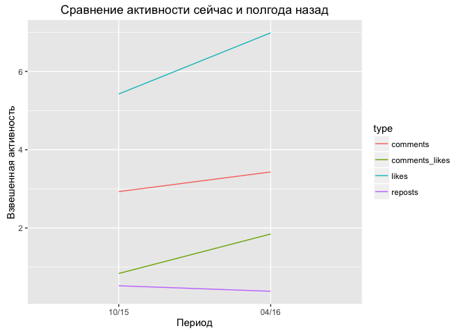
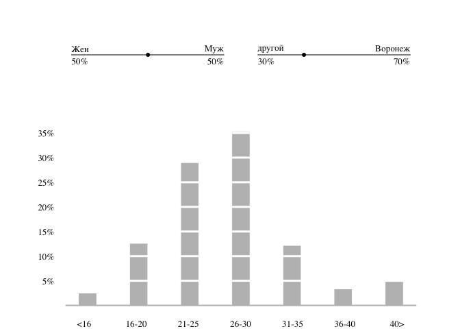
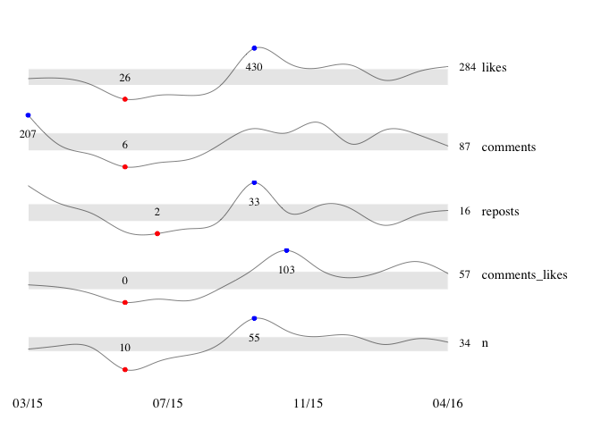
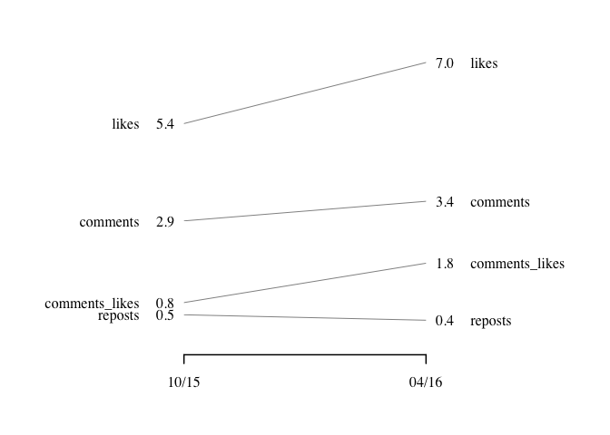

# Анализ группы ВК: часть 2, визуализация
Юрий Исаков  
Апрель 2016  


***

Отчет в трех частях о работе с данными группы ВКонтакте с помощью языка R. [Первая часть](http://rpubs.com/yurkai/runvrn_part1) описывает получение и обработку данных, [вторая](http://rpubs.com/yurkai/runvrn_part2) -- их визуализацию, а [третья часть](http://rpubs.com/yurkai/runvrn_part3) посвящена моделированию. В качестве анализируемой группы выступает [беговое сообщество Воронежа](https://vk.com/runningvrn).

***

Во второй части построим несколько графиков, которые дадут общее представление о сообществе и его участниках. Попробуем оформить графики в стиле [Эдварда Тафти](http://www.edwardtufte.com/).

### 1. Начало

Воспользуемся данными, полученными из части 1, информацией об участниках и активности на стене. Перед этим загрузим необходимые библиотеки.


```r
Sys.setlocale('LC_ALL','utf-8') # если нет проблем с кодировкой, отключите эту строчку
```

```
## [1] "C/utf-8/C/C/C/C"
```

```r
library(dplyr)
library(tidyr)
library(ggplot2)
load("runningvrn.RData")
```

### 2. Подготовка данных к визуализации

Получим нужную информацию из таблиц `members` и `posts`, немного преобразовав данные.

Из первой таблицы заменим численный признак пола на текстовый, а города разделим на Воронеж/другой (ведь это беговое сообщество Воронежа). Возраст участников разобьем на категории c шагом 5 лет (см. код). Участников, которые не указали свой возраст в профиле, учитывать в статистике не будем (а не присваивать категорию "возраст не указан", например). Посмотрим на полученные данные.


```r
# Пол: (1,2) -> (Ж,М) -> (F, M)
members$sex <- ifelse(members$sex==1, 'Жен', 'Муж')
sex <- table(na.omit(members$sex))
# город -> (Врн, другой)
city_vrn <- table(ifelse(members$city=='Воронеж', 'Воронеж', 'другой'))
# данные для гистограммы возраста пользователей
age_intervals <- c(16, 21, 26, 31, 36, 41)
age_names <- c('<16', '16-20', '21-25', '26-30', '31-35', '36-40', '40>')
age_bins = table(findInterval(na.omit(members$age), age_intervals))
names(age_bins) <- age_names
# посмотрим на данные
sex
```

```
## 
## Жен Муж 
## 320 318
```

```r
city_vrn
```

```
## 
## Воронеж  другой 
##     445     193
```

```r
age_bins
```

```
##   <16 16-20 21-25 26-30 31-35 36-40   40> 
##     6    30    69    84    29     8    12
```

Из таблицы `posts` получим помесячную активность на стене по количеству лайков к постам и комментариям к ним, количеству репостов, лайков к комментариям и количеству самих постов на стене. Еще определим среднее количество лайков/комментариев/репостов/лайков к комментариям на каждый пост на текущий месяц (апрель 2016) и сравним с данными полугодовалой давности (октябрь 2015).


```r
# статистика активности на стене по месяцам
df_sparklines <- posts %>% 
    mutate(period = as.Date(cut(date, breaks='month')),
           comments_likes = sapply(comments_likers, 
                                   function(p) length(unlist(p)))) %>%
    group_by(period) %>% 
    summarise(likes=sum(likes), comments=sum(comments), reposts=sum(reposts), 
              comments_likes=sum(comments_likes), n=n()) %>%
    as.data.frame()

# данные в пересчете на один пост: полгода назад и сейчас
df_slope <- data.frame(colSums(df_sparklines[1:8,2:5])/
                           sum(df_sparklines$n[1:8]),colSums(df_sparklines[9:14,2:5])/
                           sum(df_sparklines$n[1:8]))
names(df_slope) <- format(c(df_sparklines[8,1], df_sparklines[14,1]), '%m/%y')
# выведем данные
df_sparklines
```

```
##        period likes comments reposts comments_likes  n
## 1  2015-03-01   189      207      31             35 28
## 2  2015-04-01   192       88      20             30 31
## 3  2015-05-01   136       53      14             17 29
## 4  2015-06-01    26        6       3              0 10
## 5  2015-07-01    57       22       2              7 17
## 6  2015-08-01    56       36       5              4 23
## 7  2015-09-01   145       98      11             30 34
## 8  2015-10-01   430      155      33             67 55
## 9  2015-11-01   318      137      15            103 44
## 10 2015-12-01   273      179      19             66 39
## 11 2016-01-01   296       94      17             49 40
## 12 2016-02-01   176      148       7             63 32
## 13 2016-03-01   239      134      13             81 37
## 14 2016-04-01   284       87      16             57 34
```

```r
df_slope
```

```
##                    10/15     04/16
## likes          5.4229075 6.9867841
## comments       2.9295154 3.4317181
## reposts        0.5242291 0.3832599
## comments_likes 0.8370044 1.8458150
```

### 3. Черновая визуализация данных

Сделаем быстрые графики информации пола, городов и возраста используя  базовую графику R и библиотеку *ggplot2*. 


```r
# Пол и город
par(mfrow=c(1,2))
barplot(sex, main='Пол участников')
barplot(city_vrn, main='Город участников')
```

<!-- -->

```r
# Возраст
par(mfrow=c(1,1))
hist(members$age, main='Возраст участников', 
     xlab='Возраст', ylab='Частота')
```

<!-- -->

```r
# статистика активности в группе на стене
ggplot(data=gather(df_sparklines, 'value', 'type', 2:6), aes(period, type)) + geom_line(aes(colour=value))+
    labs(title='Активность участников группы', x='Дата', y='Количество')
```

<!-- -->

```r
# сравнение активности сейчас и полгода назад в пересчете на один пост
ggplot(data=gather(cbind(df_slope, type=row.names(df_slope)), 'x', 'value', 1:2), 
       aes(x, value, group = type)) + geom_line(aes(colour=type)) + 
    labs(title='Сравнение активности сейчас и полгода назад', 
         x='Период', y='Взвешенная активность')
```

<!-- -->

Хотя получившиеся графики информативны и выполняют свою задачу,  оформим руководствуясь принципами Эдварда Тафти из книги "Visual Display of Quantitative Information". На данный момент в R нет единой библиотеки, которая бы делала подобные графики, хотя [есть реализации](http://motioninsocial.com/tufte/) отдельных из них. 

### 4. Аккуратная визуализация данных

В этом разделе описаны функции для отображения графиков. Будем использовать базовую графическую систему. Описанные функции, возможно, потребуют доработки для других данных, но в нашем случае они справляются с поставленной целью. Также позволим себе не подписывать заголовки к графикам и оси в очевидных случаях, что является плохой практикой, но в данном случае являются исключением по скромному мнению автора.

#### 4.1. Информация о пользователях

Представим соотношения из переменных пола и города не в виде "столбиков", а точкой на отрезке. В нашем случае интересны процентные соотношения, а не абсолютные значения числа мужчин/женщин или жителей города среди участников сообщества.

Гистограмму возрастов сведем к построению столбиковой диаграммы (barplot), потому как мы уже рассчитали частоты для каждой возрастной категории. Здесь опять перейдем от абсолютных единиц к процентам.


```r
# получаем десятичное значение в проценты. 0.19 -> "19%"
get_percent <- function(x, digits=0){
    paste0(round(x*100, digits), '%')
}

# отображаем соотношение двух величин
propplot_norm <- function(n1, n2, digits = 0){
    # нормализация
    prop = c(n1, n2) / (n1 + n2)
    x <- c(0, 1)
    y <- c(0, 0)
    plot(x, y, type = 'l', axes=F, xlab="", ylab="")
    points(prop[1], 0, pch=16)
    # подписи
    text(0, 0.2, names(prop[1]), adj=c(0, NA), family="serif")
    text(1, 0.2, names(prop[2]), adj=c(1, NA), family="serif")
    text(0, -0.2, get_percent(prop[1], digits), adj=c(0, NA), family="serif")
    text(1, -0.2, get_percent(prop[2], digits), adj=c(1, NA), family="serif")
}

# гистограмма, аналогичная barplot
# названия колонок указаны в именах bins, bins > 0
# cuts -- высота кирпичиков, по умолчнию = 0.10 = 10%
brickplot_norm <- function(bins, cuts = .10){
    # нормализация
    bins = bins / sum(bins)
    # столбики
    barplot(bins, xaxt="n", yaxt="n", ylab="", 
            border=F, width=c(.35), space=1.8)
    # оси
    axis(1, at=(1:length(bins))-.26, labels=names(bins), 
         tick=F, family="serif")
    axis(2, at=seq(cuts, (max(bins) %/% cuts) * cuts, cuts), 
         labels = get_percent(seq(cuts, (max(bins) %/% cuts) * cuts, cuts)),
         las=2, tick=F, family="serif")
    # делим столбики на кусочки
    abline(h=seq(cuts, (max(bins) %/% cuts) * cuts, cuts), col="white", lwd=3)
    # фундамент для столбиков
    abline(h=0, col="gray", lwd=2)
}
```

Скомбинируем все в одну фигуру:


```r
layout(matrix(c(1,2,3,3), 2, 2, byrow = TRUE), widths=c(2,2), heights=c(1,2))
par(mar=c(2,6,2,0))
propplot_norm(sex[1],sex[2])
par(mar=c(2,2,2,4))
propplot_norm(city_vrn[2],city_vrn[1])
par(mar=c(2,6,2,4))
brickplot_norm(age_bins, cuts=.05)
```

<!-- -->


#### 4.2. Искрографики активности пользователей на стене

Искрографики (sparklines) хорошо подходят как для использования в тексте, так и сами по себе. Функция `sparklines()` принимает в качестве аргумента датафрейм, первая колонка которого представляет собой значения аргументов (в нашем случае это информация о месяце и года). Все остальные содержат вектора значений.

Параметр `smooth` отвечает за сглаживание данных сплайнами, отключив его получим кусочно-линейный график, что лучше подходит когда наблюдений достаточно много. У нас информация за 14 месяцев, поэтому будем использовать сглаживание (сплайны практически не вводят ложные экстремумы). 

Параметр `box` используется для отображения серой полосы, в оригинале, нормального диапазона (диапазон 95% типичных значений, определяется экспертом в предметной области). Будем использовать серую полосу для отображения либо интерквартильного размаха (`iq`) или 95% доверительного интервала среднего значения характеристик активностей по месяцам (значение `ci`). При любом другом значении этого параметра серая полоса не отображается. 

Наряду с последним значением каждого вектора на графике отображаются наименьшее и наибольшее значения красной и синей точками соответственно.


```r
# multi sparklines
# dat -- датафрейм, где первая колонка ось аргументов, а остальные -- линии
# box -- серая полоса. либо интерквартильный размах (iq),
# либо доверительный 95% интервал для среднего (ci)
sparklines <- function(dat, smooth=TRUE, box=c('iq', 'ci')[2]){
    # параметры отображения
    POINTS <- 201 # кол-во точек интерполяции
    N <- length(dat[,1]) # кол-во наблюдений
    lwd <- 0.5 # толщина линии графика
    ticks = 4 # кол-во подписей осей аргумента, если это дата
    # отступы графиков
    par(mfrow=c(ncol(dat)-1,1), mar=c(1,0,0,8), oma=c(4,1,4,4))
    # вектор аргументов
    if (smooth) x = seq(1, nrow(dat), len=POINTS)
    else x = 1:nrow(dat)
    # отрисовываем каждую колонку
    for (i in 2:ncol(dat)){
        # сглаживаем линию сплайном, если задан smooth
        if (smooth){
            y <- dat[,i]
            s <- smooth.spline(y, spar = 0.01)
            y <- predict(s, x)$y
        } 
        # без сглаживания
        else {
            y <- dat[,i]
        }
        # рисуем линию, но не отображаем ее %) тобы задать диапазоны x,y
        # т.к. все остальное мы хотим нарисовать поверх серого бокса
        plot(x, y, lwd=lwd, axes=F, ylab="", xlab="", main="", 
             type="n", new=F)
        # серый бокс
        # если выбран интерквартильный размах
        if (box == 'iq'){
            y_box_lo <- quantile(df_sparklines$likes)[2]
            y_box_hi <- quantile(df_sparklines$likes)[4]
        } 
        # если выбран доверительный интервал среднего
        else if (box == 'ci'){
            y_box_lo <- t.test(dat[,i])$conf.int[1]
            y_box_hi <- t.test(dat[,i])$conf.int[2]
        }
        # если без бокса
        else {
            y_box_lo <- 0
            y_box_hi <- 0
        }
        rect(1, y_box_lo, nrow(dat), y_box_hi, border=0, 
             col = rgb(192, 192, 192, alpha=90, maxColorValue=255))
        # отображаем спарклайн
        lines(x, y, lwd=lwd)
        # последнее значение
        axis(4, at=dat[nrow(dat),i], labels=round(dat[nrow(dat),i]), tick=F, 
             las=1, line=-1.5, family="serif", cex.axis=1.2)
        # подпись колонки
        axis(4, at=dat[nrow(dat),i], labels=names(dat[i]), tick=F, line=.5, 
             family="serif", cex.axis=1.4, las=1)
        # координаты минимального и максимального значения
        ymin <- min(dat[,i]); xmin <- which.min(dat[,i]) 
        ymax<-max(dat[,i]); xmax <- which.max(dat[,i])
        # подпись максимального и минимальных значений
        text(xmax, ymax, labels=round(max(ymax),0), family="serif", 
             cex=1.2, adj=c(0.5,3))
        text(xmin, ymin, labels=round(ymin,0), family="serif", 
             cex=1.2, adj=c(0.5,-2.5))
        # рисуем точки минимума и максимум
        points(x=c(xmin,xmax), y=c(ymin,ymax), pch=19, cex=1,
               col=c("red","blue"))
    }
    # подписываем ось. если это даты, то там ticks меток
    if (class(dat[,1]) == 'Date') {
        # считаем, что даты расположены по возрастанию. подписываем метки
        labels = format(seq(dat[1,1], dat[N,1], len=ticks), '%m/%y')
        axis(1, at=seq(1, nrow(dat), len=ticks), pos=c(-5), tick=F, 
             family="serif", cex.axis=1.4, labels=labels)
    }
    # если не даты, то подписываем первым столбцом dat
    else {
        axis(1, at=1:N, labels=dat[,1], pos=c(-5), tick=F, 
             family="serif", cex.axis=1.4)
    }
}
```

Используем функцию с параметрами по умолчанию — со сглаживанием и серой полосой 95% доверительного интервала среднего, (опрометчиво) считая, что характеристики распределены нормально, а их дисперсии и средние неизвестны. 


```r
sparklines(df_sparklines)
```

<!-- -->


#### 4.3. Сравнение активности пользователей за прошедшие полгода

Датафрейм `df_slope` содержит значения о среднем количестве лайков, комментариев, репостов и комментариев к посту на стене в пересчете на единицу. Например, до октября 15 года к каждому посту на стене было в среднем 3 комментария. 

Используем слоупграф (к сожалению, нет устоявшегося русского термина) для качественного сравнения скорости изменения наших удельных характеристик. Для данных, содержащих несколько периодов сравнения есть неплохая [библиотека](https://github.com/leeper/slopegraph). Но напишем свою функцию этого графика для двух периодов.

Все данные содержатся в датафрейме, передаваемом функции. Имена строк соответствуют названию характеристики, а имена колонок периоду наблюдения (см. выше).


```r
# слоупграф для двух колонок
# используются имена рядов и колонок
slopegraph_2col <- function(df){
    # отступы графика
    par(mfrow=c(1,1), mar=c(2,4,1,4), oma=c(4,6,2,6))
    # задаем диапазон значений в графике и убираем все ненужное
    x = c(0, 1)
    ymin = min(df)
    ymax = max(df)
    plot(x, c(ymin, ymax), type='n', axes=F, ylab="", xlab="", main="")
    # отрисовываем линии
    apply(df, 1, function(row) lines(x, row, lwd=.5))
    # подписываем значения
    at1 = df[,1]; at2 = df[,2]
    axis(2, at=at1, labels=format(round(df[,1],1), nsmall = 1), tick=F, 
         las=1, line=-1., family="serif", cex.axis=1.)
    axis(4, at=at2, labels=format(round(df[,2],1), nsmall = 1), tick=F, 
         las=1, line=-1., family="serif", cex.axis=1.)
    # подисываем имена
    axis(2, at=at1, labels=row.names(df), tick=F, line=1., 
         family="serif", cex.axis=1., las=1)
    axis(4, at=at2, labels=row.names(df), tick=F, line=1., 
         family="serif", cex.axis=1., las=1)
    # подписываем нижнию ось
    axis(1, at = x, labels = names(df), family="serif", cex.axis=1., 
         las=1, pos=-.5, lwd=1.5)
}
```

Отобразим график:


```r
slopegraph_2col(df_slope)
```

<!-- -->

### 5. Заключение

Осторожно предположим, что коллектив сообщества участников сложился, характеристики активности колеблются в диапазоне средних значений и за последние полгода участники стали активнее комментировать и лайкать посты/комментарии друг друга (количество репостов почти не изменилось, участники получают информацию из группы, а не от друзей). Большинство членов сообщества из Воронежа, в возрасте от 20 до 30 лет, с равными долями полов.


