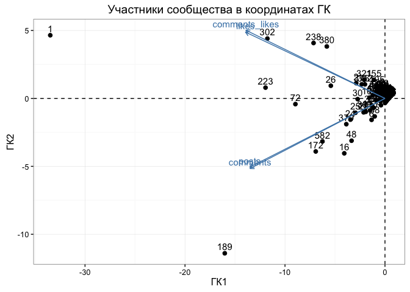
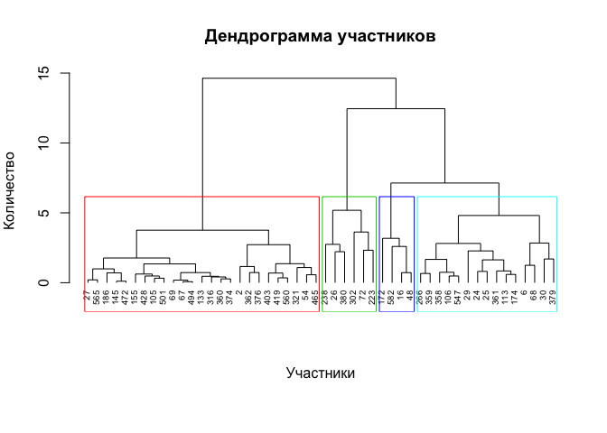
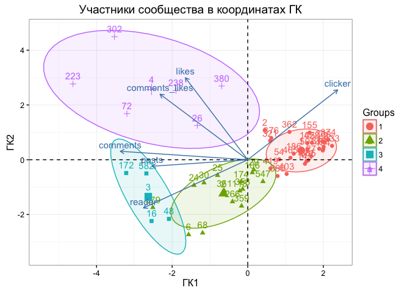

# Анализ группы ВК: часть 3, моделирование
Юрий Исаков  
Май 2016  

***

Отчет в трех частях о работе с данными группы ВКонтакте с помощью языка R. [Первая часть](http://rpubs.com/yurkai/runvrn_part1) описывает получение и обработку данных, [вторая](http://rpubs.com/yurkai/runvrn_part2) -- их визуализацию, а [третья часть](http://rpubs.com/yurkai/runvrn_part3) посвящена моделированию. В качестве анализируемой группы выступает [беговое сообщество Воронежа](https://vk.com/runningvrn).

***

В третьей части применим методы машинного обучения, чтобы получить больше информации из данных, полученных в части 1.

### 1. Начало

Загрузим необходимые библиотеки и данные из первой части. 


```r
Sys.setlocale('LC_ALL','utf-8') # если нет проблем с кодировкой, отключите эту строчку
```

```
## [1] "C/utf-8/C/C/C/C"
```

```r
library(dplyr)
library(ggplot2)
library(car)
library(lmtest)
library(factoextra)
library(clValid)
load("runningvrn.RData")
```

Преобразуем данные для моделей, получим: активность каждого пользователя за последние полгода (чтобы история не мешала) и активность всех пользователей на стене. 

Для первой таблички напишем функцию, которая для каждого учатника из датафрейма `members` возвращает его активности на основе датафрейма `posts` -- посты, лайки, комментарии, лайки к другим комментариям и суммарное количество действий между датами `date_lo` и `date_hi` (могут быть пропущены, тогда будут включены самые ранние или самые поздние активности соответственно).

Для второй таблички посчитаем количество репостов, лайков, комментариев, лайков к комментариям и записей на стене за каждый месяц.


```r
# Возвращает активность пользователей из members на основании posts
# считаем, что вся активность к посту была в день его написания ;)
members_activity <- function(members, posts_all, date_lo=NULL, date_hi=NULL){
    # датафрейм с активностью пользователей
    df <- data.frame(uid = members$uid)
    # округляем даты, чтобы не зависеть от времени поста
    posts_all$dat <- round(posts_all$date, units = 'days')
    if (is.null(date_lo)) date_lo <- min(posts_all$date)
    if (is.null(date_hi)) date_hi <- max(posts_all$date)
    posts <- subset(posts_all, date >= date_lo & date <= date_hi)
    # считаем за период кто и сколько раз:
    # писал посты на стену (участники/админы)
    act_posters <- c(posts$author, posts$whodidthis)
    # лайкал посты
    act_likers <- unlist(posts$likers)
    # комментировал посты
    act_commenters <- unlist(posts$commenters)
    # лайкал комментарии
    act_comments_likers <- unlist(posts$comments_likers)
    
    # заполняем активности для каждого пользователя
    for (i in 1:dim(df)[1]) {
        # имя одной строкой
        df$full_name[i] <- paste(members$first_name[i],
                                 members$last_name[i])
        # считаем активность за период
        df$posts[i] <- sum(act_posters == df$uid[i], na.rm = TRUE)
        df$likes[i] <- sum(act_likers == df$uid[i])
        df$comments[i] <- sum(act_commenters == df$uid[i])
        df$comments_likes[i] <- sum(act_comments_likers == df$uid[i])
        df$all[i] = sum(df$posts[i], df$likes[i], df$comments[i],
                        df$comments_likes[i])
    }
    
    df
}

# получим данные об активности каждого пользователя за последние полгода
act_hy <- members_activity(members, posts, 
                          as.POSIXct('2015-10-01', origin="1970-01-01", 
                                     tz = 'Europe/Moscow'))

# соберем активности пользователей на стене за все время
month_activity <- posts %>% 
    mutate(period = as.Date(cut(date, breaks='month')),
           comments_likes = sapply(comments_likers, 
                                   function(p) length(unlist(p)))) %>%
    group_by(period) %>% 
    summarise(likes=sum(likes), comments=sum(comments), reposts=sum(reposts), 
              comments_likes=sum(comments_likes), n=n()) %>%
    as.data.frame()
```


### 2. Активность пользователей на стене

Создатель клуба хотел бы увеличить число репостов, чтоб увеличить аудиторию. Построим линейную регрессию репостов от остальных активностей.


```r
# посмотрим на данные
head(month_activity)
```

```
##       period likes comments reposts comments_likes  n
## 1 2015-03-01   189      207      31             35 28
## 2 2015-04-01   192       88      20             30 31
## 3 2015-05-01   136       53      14             17 29
## 4 2015-06-01    26        6       3              0 10
## 5 2015-07-01    57       22       2              7 17
## 6 2015-08-01    56       36       5              4 23
```

```r
# и построим линейную модель
fit <- lm(reposts~likes+comments+comments_likes, data = month_activity)
summary(fit)
```

```
## 
## Call:
## lm(formula = reposts ~ likes + comments + comments_likes, data = month_activity)
## 
## Residuals:
##     Min      1Q  Median      3Q     Max 
## -4.9257 -2.0923 -0.2335  2.6726  3.9184 
## 
## Coefficients:
##                Estimate Std. Error t value Pr(>|t|)    
## (Intercept)    -1.34365    2.03317  -0.661 0.523633    
## likes           0.08525    0.01480   5.761 0.000182 ***
## comments        0.10748    0.02277   4.720 0.000817 ***
## comments_likes -0.28003    0.05730  -4.887 0.000636 ***
## ---
## Signif. codes:  0 '***' 0.001 '**' 0.01 '*' 0.05 '.' 0.1 ' ' 1
## 
## Residual standard error: 3.383 on 10 degrees of freedom
## Multiple R-squared:  0.8981,	Adjusted R-squared:  0.8675 
## F-statistic: 29.37 on 3 and 10 DF,  p-value: 2.849e-05
```

Неожиданно, скорректированный коэффициент детерминации оказался высоким, `R.adj=0.87`, а регрессоры статистически значимыми.

И пусть данных (по месяцам) мало, проверим их на мультиколлинеарность, гетероскедастичность, отстутствие объясняющих переменных и автокорреляцию:

* коэффициенты вздутия дисперсии оказались не высоки -- меньше 10, общепринятого значения, поэтому считаем, что мультиколлинеарность не присутствует (что неудивительно, регрессоры-то статистически значимы!);

* тест на гетероскедастичность (Бройша-Пагана): остатки в модели плохо предсказываются регрессорами, поэтому гипотезу о гетероскедастичности отвергаем;

* тест на автокорреляцию (Бройша-Годфри): данные представляют собой временной ряд, но недостаточно данных, чтобы отвергнуть гипотезу об отсутствии автокорреляции;

* тест на наличие пропущенных регрессоров (Рамси): гипотеза о линейной зависимости от регрессоров не может быть отвергнута, нелинейные члены не нужны.


```r
# коэффициенты вздутия дисперсии
# меньше 10, мультиколлинеарность не присутствует
vif(fit)
```

```
##          likes       comments comments_likes 
##       3.238729       2.129060       3.592580
```

```r
# тест на гетероскедастичность
# недостаточно данных, чтобы отвергнуть гипотезу о гомоскедастичности
bptest(fit)
```

```
## 
## 	studentized Breusch-Pagan test
## 
## data:  fit
## BP = 5.9607, df = 3, p-value = 0.1135
```

```r
# тест на автокорреляцию
# гипотезу об отсутствии автокорреляции второго порядка не отвергаем
bgtest(fit, order=2)
```

```
## 
## 	Breusch-Godfrey test for serial correlation of order up to 2
## 
## data:  fit
## LM test = 1.743, df = 2, p-value = 0.4183
```

```r
# тест на отсутствие объясняющих переменных
# p-value велико, нет необходимости добавлять нелинейные члены
resettest(fit)
```

```
## 
## 	RESET test
## 
## data:  fit
## RESET = 0.032778, df1 = 2, df2 = 8, p-value = 0.9679
```

В этой модели все прекрасно: зависимая переменная отлично объясняется регрессорами, они статистически значимы, сама регрессия прошла тесты на отстутствие гетероскедастичности, мультиколлинеарности, автокорреляции и пропущенных переменных. И если бы такая связь между количеством репостов и лайками, комментариями, лайками к комментариями означала бы причинноость, можно было бы получить очевидное руководтство к действию для распространения новостей группы! Не будем относиться к этому серьезно, раскрасить в голубые и розовые тона оказалось очень легко (например, если разбить данные по неделям, мы получим иной результат).

### 3. Кластерный анализ участников группы

Попробуем разбить пользователей на группы в зависимости от их активностей: посты на стене, комментарии к ним и лайки к постам и комментариям. 

Отобразим пользователей в пространстве первых двух главных компонент (они объясняют 94% дисперсии), также отображаются вектора исходных переменных. Первое, что бросается в глаза -- участники `1` и `189`, которые съедают весь масштаб отображения. Еще можно заметить, что большая часть членов группы не проявляла никакой активности. Таким образом, получены первые две группы -- администраторы сообщества (вывод можно сделать не зная факта напрямую), один из которых автор, вторая -- участники, выводы о которых мы не можем сделать кроме того, что они никак себя не проявляют.


```r
pca <- prcomp(act_hy[, 3:6], scale=TRUE)
fviz_pca_biplot(pca) + theme_bw() + 
    labs(title ="Участники сообщества в координатах ГК", x = "ГК1", y = "ГК2")
```



```r
# Большая часть участников никак не проявляла активности
# (суммарное число всех активностей и количество участников под ней)
table(act_hy$all)[1:5]
```

```
## 
##   0   1   2   3   4 
## 399  88  38  22  13
```

Введем новые признаки `clicker` и `reader`. Первый отвечает за долю односложных действий (пользователь кликнул лайк к посту или комментарию), а с помощью второго оценим насколько пользователю интересно читать обсуждения к посту (доля комментариев и лайков к ним по отношению к общему количеству действий). Отсеем пользователей, для которых мы уже определили классы и оценим на сколько кластеров можно разбить временный датафрейм (также используя два новых признака):


```r
# вводим признак класса пользователя
act_hy$cls <- 0
# администраторы -- класс 6
act_hy$cls[c(1, 189)] <- 6
# неактивные участники (7 и меньше действий) -- класс 1
act_hy$cls[act_hy$all <= 7] <- 1

# добавим признаки clicker и reader 
act_hy = mutate(act_hy, clicker = (likes+comments_likes)/(all+1e-9),
                reader = (comments+comments_likes)/(all+1e-9))

# можно сделать имена строк именами участников, что наглядно
# но здесь сохраним им анонимность
# rownames(act_hy) <- make.names(act_hy$full_name, unique=TRUE)

# поместим неразмеченных участников во временный датафрейм
cols = c('likes',  'comments', 'reader', 'clicker',
         'comments_likes', 'posts')
act_temp = subset(act_hy, cls==0)[cols]

# оптимальное количество кластеров в зависимости от метрики
intern <- clValid(scale(act_temp), nClust = 2:8, 
                  clMethods = c("hierarchical","kmeans","pam"),
                  validation = "internal",method='ward')
summary(intern)
```

```
## 
## Clustering Methods:
##  hierarchical kmeans pam 
## 
## Cluster sizes:
##  2 3 4 5 6 7 8 
## 
## Validation Measures:
##                                  2       3       4       5       6       7       8
##                                                                                   
## hierarchical Connectivity   9.9210 14.8480 20.4095 29.6738 32.6944 38.4282 42.8873
##              Dunn           0.0837  0.1281  0.1437  0.1437  0.1738  0.1738  0.1738
##              Silhouette     0.3293  0.4042  0.4092  0.3607  0.3662  0.3105  0.3092
## kmeans       Connectivity  14.6548 17.0774 21.4444 32.0159 35.0365 42.8563 43.5988
##              Dunn           0.0885  0.1354  0.1320  0.1437  0.1738  0.1559  0.1559
##              Silhouette     0.3975  0.4552  0.4394  0.3493  0.3547  0.3273  0.3221
## pam          Connectivity  16.1131 20.9722 31.1512 24.4651 35.6798 37.2492 45.8179
##              Dunn           0.0636  0.0862  0.1281  0.1596  0.1559  0.1581  0.0602
##              Silhouette     0.3890  0.3981  0.3062  0.4437  0.3023  0.3149  0.2765
## 
## Optimal Scores:
## 
##              Score  Method       Clusters
## Connectivity 9.9210 hierarchical 2       
## Dunn         0.1738 hierarchical 6       
## Silhouette   0.4552 kmeans       3
```

В зависимости от метрики временный датафрейм предложено разделить на 3 (на основании значений силуэта) или на 6 кластеров (используя индекс Данна). Значения метрик приведены для алгоритмов k-средних, k-медиан и иерархической кластеризации. 

После моделирования вяснилось, что в 3 кластера попадают очень разные участники, 6 кластеров оказалось много, т.к. половина из них представлена очень малым количество участников, наиболее наглядные визуализации силуэтов получаются для 5 кластеров, но оптимальным вариантом представляется делить на 4 группы. Именно для 4 кластеров результаты наиболее интерпретируемы. Воспользуемся иерархической кластеризацией: построим дендрограмму и отобразим участников группы в координатах двух главных компонент.


```r
# иерархическая кластеризация
res.hc <- hclust(dist(scale(act_temp), method = "euclidean"), 
                 method = "ward.D2" )
grp <- cutree(res.hc, k = 4)
# строим дендрограмму
par(mar=c(7,4,4,2))
plot(res.hc, cex = 0.6, main='Дендрограмма участников', 
     ylab='Количество', xlab='Участники', hang = -1, sub = "")
rect.hclust(res.hc, k = 4, border = 2:5)
```



```r
# отображаем кластеры в координатах главных компонент
pca = prcomp(act_temp, scale = TRUE)
fviz_pca_biplot(pca, habillage = grp, addEllipses=TRUE, ellipse.level=0.75) + theme_bw() + 
    labs(title ="Участники сообщества в координатах ГК", x = "ГК1", y = "ГК2")
```



Полученный точечный график можно интерпретировать следующим образом:

1) участники первого кластера, отображены точками, отличаются низкой активностью (в один клик), можно предположить, что эти пользователи не заходят в группу, а читают новости из ленты;

2) участники второго кластера, отображены треугольниками, отличаются низкой активностью, но она более разнообразная, здесь можно предположить, что эти участники нечасто пользуются социальной сетью, но они в отличие от первого кластера заходят в группу и смотрят как новости, так и посты участников;

3) участникам третьего кластера, отображены квадратиками, интересны обсуждения, они активно комментируют посты и пишут их сами, вектора `posts`, `comments` и `reader` направлены в сторону облака как раз этого кластера;

4) участники четвертого кластера, отображены крестиками, самые активные члены сообщества, они много общаются в группе, большая часть их активности приходится на лайки, как правило это знакомые между собой люди.

Теперь можно присвоить классы всем членам группы. И чем выше класс участника, тем активнее он проявляет себя в сообществе ВК. Выведем количество участников в каждом классе. Результат вполне ожидаемый, подавляющее большинство участников лишь числятся, как и в любых других сообществах.


```r
act_hy[rownames(act_temp), 'cls'] = grp + 1
table(act_hy$cls)
```

```
## 
##   1   2   3   4   5   6 
## 586  25  15   4   6   2
```


### 4. Заключение

Это небольшое исследование, пожалуй, нельзя считать объективным, потому как автор сам активный участник клуба, однако, неверно то, что данные, модели и графики подгонялись под ответ. Главной целью было выявление активных участников, которые регулярно посещают встречи клуба (пробежки, события и т.д.), что, строго говоря, не удалось. Так, встречи посещают участники из всех кластеров (например, много из первого, самого неактивного). А в кластерах 3 и 4, есть по одному участнику, кого мы не знаем лично (и ни разу не видели). Объяснить это можно довольно просто: основное общение происходит на встречах клуба, а его участники сами по себе очень разные, по сути он "офлайновый". А в сообществе представлен лишь определенный срез участников.

Тем не менее, соотнося полученные результаты с действительным положением вещей можно признать их вполне удовлетворительными. Были определены основные постмейкеры (в нашем случае администраторы), "писатели"", которые ведут больше всего обсуждений, "читатели"", которые, получают информацию о встречах из ленты новостей, а также группы участников заходящих время от времени и самых активных пользователей, которые ведут общение и в сети, и на встречах.

Если бы потребовалось взаимодействовать с участниками другого, неизвестного сообщества, то логично начать с описанных шагов, а также использовать более очевидные приемы (например, анализ меток на фотографиях).


